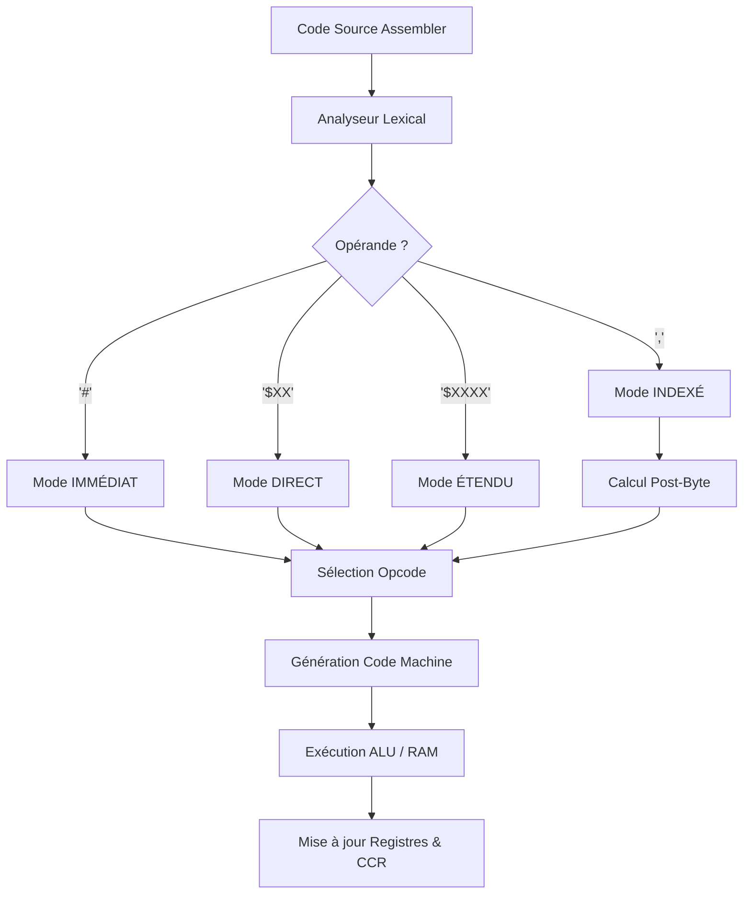

# Algorithme de Compilation et d'Exécution - Simulateur Motorola 6809

Ce document détaille le processus de transformation d'une instruction Assembleur en code machine et son exécution par le simulateur.

## Vue d'Ensemble
Le simulateur fonctionne selon un cycle **"Fetch-Decode-Execute"** (Lire-Décoder-Exécuter) simplifié, où la "compilation" (assemblage) se fait à la volée juste avant l'exécution de chaque ligne.

---

## 1. Analyse Lexicale (Parsing)
**Entrée** : Une ligne de texte brut (ex: `LDA #$10` ou `STA ,X+`)
**Responsable** : `lecture.java`

1.  **Séparation** : La ligne est découpée en mots (tokens).
    *   `Mot 1` : Mnémonique (ex: `LDA`)
    *   `Mot 2` : Opérande (ex: `#$10`)
2.  **Nettoyage** : Suppression des espaces superflus.

---

## 2. Détection du Mode d'Adressage
**C'est le cœur de l'algorithme.** Le simulateur doit comprendre *comment* accéder à la donnée.
**Responsable** : `mode.determineMode()`

L'algorithme analyse la syntaxe du `Mot 2` (Opérande) :

*   **Si** contient `[` et `]` → **INDEXÉ INDIRECT** (Phase 6)
*   **Si** contient `,` → **INDEXÉ** (ex: `,X`, `5,Y`)
*   **Si** commence par `#` → **IMMÉDIAT** (ex: `#$10`)
*   **Si** commence par `<` OU (hexadécimal longueur 2) → **DIRECT** (ex: `$10`)
*   **Si** commence par `>` OU (hexadécimal longueur 4) → **ÉTENDU** (ex: `$1000`)
*   **Sinon** (pas d'opérande) → **INHÉRENT** (ex: `NEGA`, `RTS`)

---

## 3. Résolution de l'Opcode (Traduction)
Une fois le mode identifié, l'algorithme sélectionne le code hexadécimal unique (Opcode) pour l'instruction `Mot 1`.

**Algorithme (Pseudo-code) :**
```java
SI Instruction == "LDA" :
    SI Mode == IMMÉDIAT  -> Opcode = "86"
    SI Mode == DIRECT    -> Opcode = "96"
    SI Mode == INDEXÉ    -> Opcode = "A6" (+ Post-Byte)
    SI Mode == ÉTENDU    -> Opcode = "B6"

SI Instruction == "LDB" :
    SI Mode == IMMÉDIAT  -> Opcode = "C6"
    ...
```

---

## 4. Traitement des Modes Complexes (Indexé & Indirect)
Pour le mode indexé, une **sous-routine de compilation** est lancée (`parseIndexedMode`).

1.  **Parsing Indexé** :
    *   Détecte le registre de base (X, Y, U, S).
    *   Détecte le type d'offset (5-bit, 8-bit, 16-bit, Accumulateur).
    *   Détecte les modificateurs (Auto-incrément `+`, Auto-décrément `-`).
2.  **Génération du Post-Byte** :
    *   Calcule l'octet de configuration complexe (le "Post-Byte") selon la table de spécification 6809.
    *   *Exemple* : `,X+` génère le post-byte `80`.
3.  **Gestion de l'Indirection** :
    *   Si des crochets `[]` sont présents, le bit d'indirection (Bit 4) est activé dans le Post-Byte.

---

## 5. Exécution et Mise à jour de l'État (Cycle Machine)
Une fois l'instruction entièrement décodée :

1.  **Calcul de l'Adresse Effective (EA)** :
    *   L'adresse finale où se trouve la donnée est calculée.
    *   *Si Indirection* : Une lecture mémoire supplémentaire est faite pour récupérer l'adresse cible (Déréférencement).
2.  **Accès Mémoire/Registres** :
    *   **Lecture** : Récupère la valeur à l'adresse EA (pour `LDA`, `ADD`, etc.).
    *   **Écriture** : Écrit la valeur d'un registre à l'adresse EA (pour `STA`, `STX`, etc.).
3.  **Opération ALU** :
    *   Effectue le calcul (Addition, Soustraction, ET logique...).
4.  **Mise à jour du CCR (Flags)** :
    *   Les flags Z (Zéro), N (Négatif), V (Overflow), C (Carry) sont recalculés basés sur le résultat.
5.  **Mise à jour du PC (Program Counter)** :
    *   Le pointeur d'instruction avance vers la prochaine ligne (sauf si `JMP`/`BRA`).

---

## Résumé Graphique


